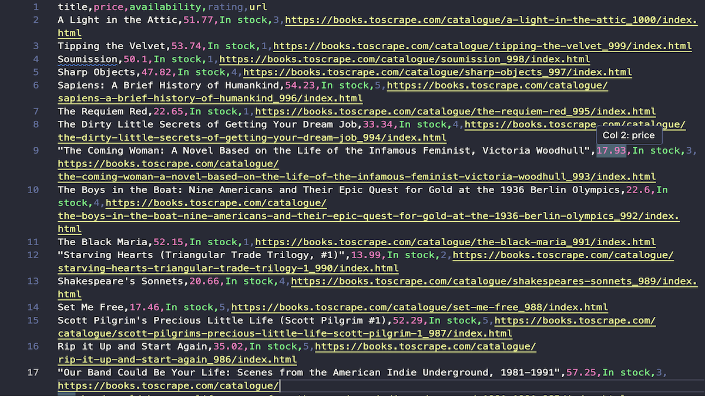

# BooksToScrape eCommerce Scraper

_Structured book catalog → clean CSVs, with pagination and detail enrichment._


A Python scraper for the [Books to Scrape](https://books.toscrape.com) demo eCommerce site.  
It navigates categories and pages, extracts book details, and saves clean CSVs for analysis or demos.

---

## 🔍 Key Features

- **Pagination** across all catalog pages or a chosen category.
- **Structured fields**: Title, Price, Availability, Rating, Category, Product URL, Image URL.
- **Optional product details**: UPC, Tax, Prices incl/excl tax, Stock count, Description.
- **Clean outputs** saved to `output/books.csv` (CSV format by default).
- **Simple config** for selectors and fields.

---

## ⚙️ Quick Start

### Prerequisites

- Python **3.10+**
- Git

### Installation

```bash
# 1) Clone
git clone https://github.com/mdugan8186/book-scraper.git
cd book-scraper

# 2) (optional) Virtual environment
python -m venv .venv
# macOS/Linux:
source .venv/bin/activate
# Windows:
.venv\Scripts\activate

# 3) Dependencies
pip install -r requirements.txt
```

### Run

```bash
python main.py
```

- Each run creates a new timestamped CSV file in the `output/` folder  
  (e.g., `books_2025-07-23_20-39-36.csv`). Older files are not overwritten.

---

## 📁 Output

- **Timestamped CSVs** saved in `output/` (e.g., `books_2025-07-23_20-39-36.csv`)

**Columns**

```
title, price, availability, rating, category, product_url, image_url, upc, tax, price_excl, price_incl, stock, description
```

---

## 🧩 Configuration

- CSS selectors and parsing logic are defined in the code (or `config.json` if available).
- Update selectors here if site markup changes.

---

## 🎥 Demo

Example of the scraper output:



The full dataset is saved as: [`output/books_2025-07-23_20-39-36.csv`](output/books_2025-07-23_20-39-36.csv)

---

## 🧪 Testing & Dev Notes

See **TESTING.md** for a step-by-step sanity flow, selector maintenance notes, and data-quality checks.

---

## 🛠️ Tech Stack

- **Requests/Playwright/Selenium** (depending on implementation)
- **BeautifulSoup / lxml / Selectolax** for parsing
- **pandas** for cleaning (optional)
- **CSV** outputs

---

## ⚖️ Legal & Ethical Use

This scraper is intended for **educational and demonstration purposes only**.  
Please review and comply with the target site’s terms of service and robots.txt before using it beyond small-scale testing or portfolio demonstration.

---

## 📄 License

This project is licensed under the **MIT License**. See [`LICENSE`](./LICENSE).

---

## 👤 About

**Mike Dugan** — Python Web Scraper & Automation Developer

- GitHub: [@mdugan8186](https://github.com/mdugan8186)
- Portfolio Website: https://mdugan8186.github.io/scraping-portfolio/
- Email: **mdugan8186.work@gmail.com**
